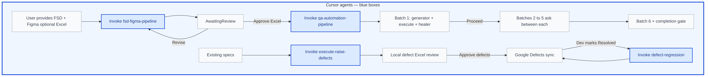

# AML Automation — Agent Guide

> Central reference for AI agents operating in this repository.
> Read this file before any planning, generation, or healing work.

---

<!-- AGENT-WORKFLOW-FLOWCHARTS:AGENTS-MD:START -->
## Agent ecosystem — how agents link together

Read this section first. It shows **which agent runs when**, **what each agent produces**, and **where you must approve** before the next step.

> **Tip:** Flowcharts below are **PNG images** — they display in any Markdown viewer. Mermaid source lives in `pipeline/scripts/agent-workflow-diagrams.cjs`.

| Symbol | Meaning |
|--------|---------|
| Solid arrow | Normal handoff |
| Dashed arrow | Optional step |
| Label on arrow | Human approval required |
| **Blue box / blue node** | **Cursor agent** (orchestrator or Playwright MCP worker) |
| Amber box / node | Output or artifact (Excel, specs, defects, gate) |
| Gray box / node | Input, legend, or human gate (not an agent) |

### Standard pipeline entry points

1. **FSD + Figma → Excel → scripts** (primary): `fsd-figma-pipeline` with **FSD + Figma required**; existing Excel is **optional** (reconcile if present, create if missing) → **Approve Excel** → `qa-automation-pipeline` (invokes `playwright-test-generator` + `playwright-test-healer` per batch) → specs under `tests/milestoneN/`
2. **Existing specs → defects**: `execute-raise-defects` → local defect Excel → **Approve defects** → Google Sheet → `defect-regression` when dev marks **Resolved**

**Orchestration:** the parent chat invokes named subagents only. If a subagent fails to load, the parent continues orchestration per pipeline checkpoint rules — it must not substitute ad-hoc URL/.docx generation for the Excel pipeline.

### Figure 1 — High-level agent map

Standard AML pipeline with numbered navigation (①–⑨). **Blue boxes = Cursor agents** (orchestrators and Playwright workers). Amber = outputs/artifacts; gray = inputs. Path A: FSD + Figma required; Excel optional on input. Path B: defects → Google → regression.

<p align="center"></p>

### Figure 2 — Primary workflow — Excel to automation

Stage 0 reconciles or creates Excel; after human approval the QA pipeline validates, normalizes, and processes six batches with live UI generation.

<p align="center"></p>

**Inside `qa-automation-pipeline` (each of 6 batches):** `playwright-test-generator` (live UI, 100% cases) → execute → `playwright-test-healer` (once, automation failures only) → verify changed cases. Ask user before batches 2–5.

### Figure 3 — Human approval gates and handoffs

Mandatory subagent invocation at each gate. Parent orchestrates only — must invoke named agents; if a subagent fails, parent continues orchestration per pipeline rules.

<p align="center"></p>

| You say | Must invoke |
|---------|-------------|
| FSD + Figma work (Excel optional for reconcile) | `fsd-figma-pipeline` |
| **Approve Excel** | `qa-automation-pipeline` |
| Run existing spec + defects | `execute-raise-defects` |
| **Approve defects** | `qa:approve-defects-sync` or `qa:sync-defects-sheet --approved` (upsert + stale prune by default) |
| Retest Resolved defects | `defect-regression` |
| Audit Excel vs FSD (optional) | `fsd-excel-coverage-audit` |

### Figure 4 — Defects and regression

Execute specs to raise local defects; sync to Google after approval. Regression retests Resolved rows.

<p align="center"></p>

### Agent files (orchestrators)

| Agent | Agent file | Invoked when |
|-------|------------|--------------|
| Stage 0 Excel | `.cursor/agents/fsd-figma-pipeline.agent.md` | FSD + Figma → test cases (Excel optional on input) |
| Coverage audit | `.cursor/agents/fsd-excel-coverage-audit.agent.md` | Independent Excel vs FSD check |
| QA pipeline | `.cursor/agents/qa-automation-pipeline.agent.md` | **Approve Excel** → scripts |
| Execute + defects | `.cursor/agents/execute-raise-defects.agent.md` | Run spec, raise defects |
| Defect regression | `.cursor/agents/defect-regression.agent.md` | Google Status = Resolved |

**Playwright workers** (invoked by `qa-automation-pipeline` only): `.cursor/agents/test-generator.agent.md`, `test-healer.agent.md`

Also available: Word export [`docs/AML-Agent-Workflows.docx`](docs/AML-Agent-Workflows.docx) · regenerate: `npm run docs:agent-workflows`
<!-- AGENT-WORKFLOW-FLOWCHARTS:AGENTS-MD:END -->


## What This Project Does

Playwright + TypeScript test automation for **AML (Anti-Money Laundering) applications**.

Test cases are authored in **Excel (.xlsx)** and converted into Playwright scripts automatically.

### Primary workflow — Excel to scripts

```
your-tests.xlsx  →  qa-automation-pipeline (Cursor agent)
                 →  tests/milestone2/**/*.spec.ts + POM
                 →  npm run milestone:run -- 2
```

**FSD + Figma → Excel (Stage 0):** agent `fsd-figma-pipeline` under `pipeline/test-data/Milestone1|2/Test Cases/`. If the named Excel **already exists**, Stage 0 **reconciles it in place** (add/update/retire via `tc-delta-report.json`); if missing, it **creates** a new workbook. Stage 0 models **dependent flow chains** (`html-inventory.json` `navGraph`/`compositeFlows`, `use-cases.json` `dependsOnUseCaseIds`, Excel Preconditions/multi-step Test Steps). Revised sources may be dropped as `*_New.docx` / `*_New.html` beside the originals — Stage 0 prefers `*_New`, emits `feature-delta-report.json` (features added/removed/updated), reconciles Excel, and on Approve hands off to `qa-automation-pipeline` (reconcile updates specs). After audit gaps, reconcile using `coverage-audit-report.json` (`uncoveredFlows`, `uncoveredChainFlows`).

On **Approve Excel**, the caller must invoke the actual
`qa-automation-pipeline` subagent with the approved workbook path (and, when
reconcile, the `tc-delta-report.json`). Reading its
agent file and performing the workflow directly in the parent is forbidden.
The invoked agent must complete Validate → Normalize → split generate-scope
cases into exactly six deterministic near-equal batches. For each batch it
invokes the existing generator as sole live-MCP owner, appends/updates tests in
**one spec per module** with live evidence (reconcile also removes retired IDs),
executes the batch, reports pass/fail, invokes the existing healer once for
classified automation failures, verifies changed cases once, reports post-heal
counts, then **asks before starting the next batch** (batches 1–5). After batch 6
it continues to aggregate Report/Gate. Agent IDs must be recorded in pipeline
state/manifest. Done only when
`results/qa-pipeline/final/pipeline-completion-gate.json`
passes (`npm run qa:verify-completion`, including
`npm run qa:detect-smoke-stubs`, and reconcile checks when `--delta` is passed).

Stage 0 **must** produce `results/fsd-figma-pipeline/<resultsKey>/coverage-matrix.json` (with `byModule` + `byFeature`), `tc-delta-report.json`, and (when `*_New` or a baseline exists) `feature-delta-report.json`. Display **overall FSD coverage % plus feature changes (added/removed/updated) plus module and feature-level tables** (and TC delta) when delivering Excel, and reach **100%** coverage (or explicit user gap acceptance) before Excel Approve / QA pipeline handoff. See `.cursor/system-context/fsd-figma-pipeline.mdc`.

See `pipeline/test-cases/SAMPLE-FORMAT.md` for Excel column layout (when using raw Excel input).

### Execution paths

| Path | Input | Output |
|------|-------|--------|
| **QA automation pipeline** (primary) | `.xlsx` test cases | `tests/milestone2/` specs + POM |
| **Execute & Raise Defects** | Existing `.spec.ts` / module folder | Local `MilestoneN/Defects/*.xlsx` (Defects + **UI Defects** sheets) for review → Google **Defects** + **UI Defects** tabs only after approval |
| **FSD + Figma Stage 0** | FSD `.docx` + Figma HTML (optional `*_New` revisions) | Excel in `Milestone1|2/Test Cases/` (create if missing, reconcile if present) + **coverage-matrix.json** + **feature-delta-report.json** + **tc-delta-report.json** (100% gate; Approve → spec sync) |
| **FSD Excel coverage audit** | Existing Excel + FSD + Figma | Independent audit report + verdict (Pass/Fail/ReviewNeeded) vs writer-claimed 100% |
| **Generator / Healer** (via QA pipeline batches) | Approved Excel test cases | `.spec.ts` + POM via live UI; healer once per batch for automation failures |

Set `BASE_URL` in `.env` before running tests. **`EMAIL` / `PASSWORD` login is currently bypassed** — do not require credentials or add login steps until the user asks to enable auth.

### AI agents

| Agent | Role | When invoked |
|-------|------|--------------|
| **FSD + Figma pipeline** | Stage 0: FSD/Figma → Excel (create or reconcile) | User provides FSD + Figma (+ Excel) |
| **QA automation pipeline** | Excel → validate → 6 batches → specs + gate | **Approve Excel** |
| **Generator** | Live UI → `.spec.ts` + POM for assigned Excel cases | Inside each QA pipeline batch |
| **Healer** | Fixes automation/locator failures once per batch | Inside each QA pipeline batch after execute |
| **Execute & Raise Defects** | Run spec/module → local defect Excel | Ad-hoc on existing specs |
| **FSD Excel Coverage Audit** | Independent Excel vs FSD/Figma verification | Optional before Approve Excel |
| **Defect Regression** | Retest **Resolved** defects → Closed/Reopened | After dev marks Resolved |

Every agent run also produces a **Word summary** under `docs/agent-runs/<agent>/`. See `docs/agent-runs/README.md`.

---

## Pipeline Flow (standard)

```
FSD + Figma  →  fsd-figma-pipeline (Stage 0)  →  Excel + coverage + TC delta
       │
       ▼  Approve Excel
qa-automation-pipeline  →  Validate → Normalize → 6 batches
       │
       ▼  each batch
playwright-test-generator (live UI)  →  Execute  →  playwright-test-healer (once)  →  Verify
       │
       ▼
tests/milestoneN/**/*.spec.ts + POM  →  completion gate  →  defects (if failures remain)
```

**Handoff rules:**
- Stage 0 hands off only after **Approve Excel** — invoke `qa-automation-pipeline` (never parent-only script generation).
- **Generator** reads assigned Excel cases — live UI mandatory; one spec per module.
- **Healer** runs at most once per batch inside `qa-automation-pipeline` for classified automation failures only.
- Healer fixes locators, timing, and navigation — **never changes test intent or business logic.**
- If a subagent fails to load, the orchestrator continues per checkpoint rules in `qa-automation-pipeline` — do not bypass with ad-hoc flows.

---

## Application Under Test

| Property | Value |
|----------|-------|
| Application | AML system at `https://kadelamldev.customerxps.com:2506` |
| Default env | `dev` (see `tests/fixtures/environments.json`) |
| Authentication | **Bypassed for now** — do not require `EMAIL` / `PASSWORD`; navigate via `BASE_URL` only until user enables login |
| Seed file | `tests/seed.spec.ts` |
| Test case input | Excel `.xlsx` in `pipeline/test-cases/` |

**Configure before first run:**

```env
ENV=dev
BASE_URL=https://kadelamldev.customerxps.com:2506
# EMAIL / PASSWORD — not required while login is bypassed
```

---

## Locator Priority

When discovering or fixing selectors, always try strategies in this order:

| Priority | Strategy | Example |
|----------|----------|---------|
| 1 | `data-testid` | `page.getByTestId('submit-btn')` |
| 2 | `getByRole` | `page.getByRole('link', { name: 'About Us' })` |
| 3 | `getByLabel` | `page.getByLabel('Email')` |
| 4 | `getByPlaceholder` | `page.getByPlaceholder('Your Name')` |
| 5 | `getByText` | `page.getByText('Contact Us')` |
| 6 | CSS (stable) | `nav.primary-menu`, `footer a[href*='privacy']` |
| 7 | XPath | Last resort only — avoid in generated code |

**Elementor-specific rules:**
- Avoid brittle hash classes (e.g. `.elementor-element-a1b2c3d`)
- Prefer `data-id`, ARIA roles, visible text, or structural CSS
- Check `tests/fixtures/selector-map.json` before guessing
- Update `selector-map.json` when new stable selectors are discovered

---

## Project Structure

```
tests/
├── e2e/                          # Generated spec files (Generator output)
├── PageObjects/
│   └── BasePage.ts               # All page objects extend this
├── objectrepositories/           # Locator definitions (no Playwright commands)
├── fixtures/
│   ├── environments.json         # URLs + shared test data per environment
│   ├── env.ts                    # Environment loader
│   ├── test-fixture.ts           # Custom Playwright fixture (testData, env)
│   └── selector-map.json         # Natural language → CSS selector map
├── helpers/                      # Reusable helpers (action-logger, healers, mocks)
├── reporters/pipeline-reporter.ts  # Allure + execution-report on every run
└── seed.spec.ts                  # MCP seed — used by planner_setup_page / generator_setup_page

specs/
├── plan.md                       # Human-readable plan (reference)
└── generated/
    └── plan.md                   # Machine plan — Generator reads this

.cursor/agents/                   # Agent command definitions
results/<env>/                    # Execution reports + Allure results
playwright.config.ts
```

---

## MCP Server

Configured in `.cursor/mcp.json`:

```
npx playwright run-test-mcp-server --headless -c .
```


**Required tools by agent:**

| Agent | MCP Tools |
|-------|-----------|
| Planner | `planner_setup_page`, `planner_save_plan`, `browser_*` |
| Generator | `generator_setup_page`, `generator_read_log`, `generator_write_test`, `browser_*`, `browser_verify_*` |
| Healer | `test_debug`, `test_run`, `test_list`, `browser_generate_locator`, `browser_*` |

Always call `planner_setup_page` or `generator_setup_page` **once** before other browser tools.
Seed file defaults to `tests/seed.spec.ts`.

---

## Shared Rules (All Agents)

### Must do
- Read `tests/fixtures/environments.json` and `.env` before starting
- Use `testData.baseUrl` — never hardcode URLs in generated code
- Import from custom fixture: `import { test, expect } from '../fixtures/test-fixture'`
- Keep tests independent — each test starts from a fresh page load
- Use Playwright auto-waiting; prefer `expect(locator).toBeVisible()` over manual waits
- Follow file creation order: **spec → locator → page object**
- Follow **locator priority** (see above)
- **Search existing code before creating anything new** (see Framework Reuse Rule)
- **Always explore the live application via MCP before generating or healing locators/POM** — open the real module URL, snapshot, then write selectors. Figma/Excel/heal shells are secondary. If live UI is unreachable, mark **Blocked** with reason; do not silently skip (see `.cursor/rules/live-ui-mandatory-for-scripting.mdc`)
- **100% live evidence whenever Generator or Healer is invoked:** Generator must live-validate every eligible UI case; Healer must capture pre/post live evidence for every case it changes, always on the correct module route. Representative subsets and stale/unrelated browser pages do not count.
- **Single MCP owner for live Generate/Heal:** only one session may drive Playwright MCP for a run. QA pipeline Generate defaults to the parent/orchestrator; do not parent+child concurrent `browser_*` (see `qa-automation-pipeline` Single MCP owner rules).

### Must not do
- Put raw selectors inside spec files
- Use `page.waitForTimeout()` or other hard waits
- Use `test.skip()`, `test.fixme()`, `test.only()`, `describe.skip()`, `describe.only()`
- Wrap actions in manual retry loops — use Playwright config retries instead
- Add login/authentication steps — **login is bypassed**; do not fill credentials until the user asks to enable auth
- Create **one `.spec.ts` per test case** — use **one `.spec.ts` per Excel module** under `tests/milestone2/` (Milestone1 pattern)
- Commit secrets or `.env` contents
- Duplicate page objects, locators, or helpers that already exist
- **Skip live UI exploration** for scripting or healing when the app is reachable
- Finalize locators from Figma/docs/heal shells alone without a live snapshot of that screen
- Drive Playwright MCP from parent and a background Generate/Heal child at the same time

### Environment variables (`.env`)
| Variable | Purpose |
|----------|---------|
| `ENV` | Selects environment block in `environments.json` (default: `production`) |
| `BASE_URL` | Overrides environment `baseUrl` |
| `PW_WORKERS` | Parallel worker count |
| `PW_SKIP_ALLURE_REPORT` | Set `1` to skip auto Allure after test run |

---

## Framework Reuse Rule

Before creating any new artifact, **search the project first**:

| Before creating | Search in |
|-----------------|-----------|
| Page object | `tests/PageObjects/` |
| Locator file | `tests/objectrepositories/` |
| Helper method | `tests/helpers/` |
| Selector | `tests/fixtures/selector-map.json` |

**Rules:**
- Extend an existing page object if the feature already has one
- Add locators to an existing locator file rather than creating a duplicate
- Move shared navigation/wait/scroll logic into `BasePage` — never copy into feature page objects
- Reuse helpers from `commands.ts` instead of inlining the same logic in specs or page objects

---

## Base Page Standard

All page objects **must extend `BasePage`** (`tests/PageObjects/BasePage.ts`).

Shared interaction methods live in `BasePage` — feature page objects must not reimplement them:

| Method | Purpose |
|--------|---------|
| `waitForPageLoad()` | Wait until `body` is visible |
| `navigateTo(url)` | Go to URL + wait for page load |
| `clickAndWait(locator)` | Click + wait for DOM ready |
| `scrollIntoView(locator)` | Scroll element into viewport |
| `takeScreenshot(name)` | Capture full-page screenshot to `test-results/screenshots/` |

**Page object pattern:**

```typescript
import { Page } from "@playwright/test";
import BasePage from "./BasePage";
import HomePageLocators from "../objectrepositories/HomePageLocators";

class HomePage extends BasePage {
  constructor(page: Page) {
    super(page);
  }

  async navigateToHome(baseUrl: string) {
    await this.navigateTo(baseUrl);
  }

  get heroSection() {
    return this.page.locator(HomePageLocators.heroSection);
  }

  async openAboutUs() {
    await this.clickAndWait(this.page.getByRole("link", { name: "About Us" }));
  }
}

export default HomePage;
```

---

## Retry Policy

Flaky UI handling is configured centrally — **never retry actions manually in test code.**

| Setting | Value | Location |
|---------|-------|----------|
| Test retries | `1` | `playwright.config.ts` → `retries` |
| Trace | `on-first-retry` | `playwright.config.ts` → `use.trace` |
| Video | `on-first-retry` | `playwright.config.ts` → `use.video` |

**Agents must not:**
- Wrap clicks or navigations in `for` loops or `while` retry blocks
- Add `test.retry()` calls inside spec bodies
- Increase retries in spec files — change `playwright.config.ts` if policy needs updating

If a test fails after the configured retry, the **Healer** fixes the root cause (selector, wait, navigation).

---

## Reporting Requirements

Reporting is automatic — agents must not disable or bypass it.

### On every test run (`playwright.config.ts`)

| Artifact | When captured |
|----------|---------------|
| Screenshot | `only-on-failure` |
| Trace | `on-first-retry` |
| Video | `on-first-retry` |
| HTML report | `playwright-report/` |

### On failure (`tests/reporters/pipeline-reporter.ts`)

The pipeline reporter automatically:
1. Captures failure screenshot from Playwright attachments
2. Copies screenshot to `results/<env>/screenshots/`
3. Attaches screenshot to Allure step result
4. Logs error message (first line of stack trace) in `execution-report.json`
5. Preserves full error in Allure `statusDetails.message`
6. Generates Allure HTML report (unless `PW_SKIP_ALLURE_REPORT=1`)

### Agent responsibilities

| Agent | Reporting duty |
|-------|----------------|
| Generator | Do not suppress Playwright attachments; use standard `expect()` assertions |
| Healer | After fixing, run `test_run` and confirm failure artifacts are gone |
| All | Run `npm run pw:run:report` at end of cycle for full Allure + Excel output |

**Do not** add custom screenshot logic in specs unless explicitly capturing a named diagnostic — rely on framework defaults.

After milestone execution and **after any pending heal cycle finishes** (or is
skipped), the reporter / `qa:generate-defects` / `qa:merge-batches` creates
`pipeline/test-data/Milestone<N>/Defects/<module>-defects.xlsx` for modules
with **remaining** failed test cases. **N** is resolved from Stage 0 artifacts
(Test Cases + FSD + Figma under `Milestone1/` or `Milestone2/`) by Test Case ID
(`resolve-defect-milestone.cjs`), not from spec folder alone. Each row includes Milestone (`M1`/`M2`),
Feature (functional scenario area within the module, such as Tab Navigation,
Periodic Review Schedule, Page Layout and Navigation, or Maker-Checker Approval —
never a repeated module/page name or Playwright suite name), and
Assigned To (feature owners from M1 `AML-Daily-Tracker.xlsx` and M2 live tracker
cache). Defect rows must pass `validate-defect-plain-language.cjs` (automatic in
`generateDefectFiles`; see `.cursor/rules/defect-plain-language-mandatory.mdc`).
`Summary`, `Steps to Reproduce`, `Expected Result`, and `Actual Result`
must be detailed (no generic placeholders or title-only steps) and written in
simple plain English — no selectors, Playwright API names, stack traces, or
millisecond values (state waits in seconds). Do not include FSD requirement
traceability IDs in narratives (`BR-011`, `NFR-001`, etc.) — use plain behaviour
text only; generator strips them via `plainLanguageNarrative`. Summary must not
contain TC IDs or URLs; steps/actual results use the module page name instead of
URLs. Defect ID is `DEF-M<N>-<Test Case ID>` without a duplicated module prefix
(for example `DEF-M1-SC-TC-002`). Defect rows use a single **Status** column
(`New`, `In Progress`, `Resolved`, `Reopened`, `Closed`; default **New** on
raise), **Severity** and **Priority** (assigned at defect generation from the
test execution report via `classify-defect-severity-priority.cjs`; Google sync
fills empty cells only — preserves values once set; regression never touches them),
and omit `Sub Module`, `Frontend Developers`, `Backend Developers`, `Executed At`,
`Local Defect File`, `Classification`, and `Screenshot Reference`. Local Excel is
written first; Google Sheet sync happens only after human approval of that local
sheet (`npm run qa:sync-defects-sheet -- --approved`). Rows must be
**contiguous** on the Defects tab (no blank spacer rows between defects). See
`.cursor/rules/defect-google-sheet-sync.mdc`. Defect rows are unique by
Test Case ID (Milestone + TC): re-runs upsert, never duplicate. No defect
workbook is created for a module with zero remaining failures. While heal may
still run, set `PW_DEFER_DEFECT_GENERATION=1` so sheets are not written early.

The same rows are synced to the shared Google Sheet **Defects** tab
(`npm run qa:sync-defects-sheet -- --approved`) when CDP Chrome is running
(`npm run tracker:cdp-chrome`). Both milestones write into that one Defects tab.
Sync batch-appends new rows and rewrites contiguously on upsert so blank gaps
from prior bad syncs are removed.
If CDP/sign-in is unavailable, local files still generate and Google sync is
reported Blocked.

**Defect regression (Google only):** invoke `@.cursor/agents/defect-regression.agent.md`
or `npm run tracker:cdp-chrome` then `npm run qa:defect-regression -- --milestone <N>`.
Reads **only the shared Google Defects tab** for **Status = Resolved**. Pass → **Closed**;
fail → **Reopened**. Updates **Status only on Google** (never Severity/Priority).
Status is written **on Google automatically** after regression (no approval step).
See `.cursor/rules/defect-status-guardrails.mdc`.
---

## Stage 0 — FSD + Figma pipeline (test case authoring)

**When to use:** User provides FSD `.docx` + Figma HTML (and optional existing Excel) to create or reconcile manual test cases.

**Agent:** `fsd-figma-pipeline` — see `.cursor/agents/fsd-figma-pipeline.agent.md` and `.cursor/system-context/fsd-figma-pipeline.mdc`.

**Output:** Excel under `pipeline/test-data/MilestoneN/Test Cases/`, `coverage-matrix.json`, `tc-delta-report.json`, and (when applicable) `feature-delta-report.json`. Human **Approve Excel** hands off to `qa-automation-pipeline`.

---

## Generator Agent (QA pipeline worker)

**When to use:** Inside each `qa-automation-pipeline` batch — assigned Excel UI cases only. Not invoked standalone for ad-hoc URL or scenario input.

**Before starting — read:**
1. Assigned Excel cases from the batch manifest — **source of truth; never invent scenarios**
2. `tests/fixtures/environments.json`
3. `tests/fixtures/selector-map.json`
4. `tests/fixtures/test-fixture.ts`
5. `tests/helpers/` and existing `BasePage` / milestone page objects
6. **Search existing** `PageObjects/`, `objectrepositories/`, and `commands.ts` for reusable code

**Workflow (per Excel case):**
1. Check if spec, locator, or page object already exists for this case — extend if yes
2. Call `generator_setup_page` for the case
3. Navigate to the case's live module URL and execute each Excel Test Step using `browser_*` tools
4. Call `generator_read_log` to retrieve captured interactions
5. Call `generator_write_test` with the generated TypeScript source (append to one spec per module)
6. Create or extend POM files following **Base Page Standard** and **locator priority**

**Generated spec standards:**

```typescript
// spec: specs/generated/plan.md
import { test, expect } from "../fixtures/test-fixture";
import HomePage from "../PageObjects/HomePage";

test.describe("Homepage Tests", () => {
  test("Test Case ID:1.1 - Homepage loads successfully", async ({ page, testData }) => {
    const homePage = new HomePage(page);

    // 1. Navigate to homepage
    await homePage.navigateToHome(testData.baseUrl);

    // expect: Dashboard is visible
    await expect(page.getByText(/Dashboard/i)).toBeVisible();

    // expect: Hero heading is visible
    await expect(homePage.heroSection).toBeVisible();
  });
});
```

**Locator file pattern:**
```typescript
const HomePageLocators = {
  heroSection: ".elementor-heading-title, h1",
  navMenu: "nav, .elementor-nav-menu",
  contactLink: 'a[href*="contact"]',
};
export default HomePageLocators;
```

**Naming conventions:**
| Artifact | Pattern | Example |
|----------|---------|---------|
| Spec file (Milestone2 / QA pipeline) | **One file per Excel module** | `missing-mandatory.spec.ts` (all MM cases) |
| Spec file (legacy e2e / single-scenario) | `<feature>-<action>.spec.ts` | `homepage-loads.spec.ts` |
| Locator file | `<Feature>Locators.ts` | `HomePageLocators.ts` |
| Page object | `<Feature>.ts` extends `BasePage` | `HomePage.ts` |
| Test title | `Test Case ID:<id> - <description>` | `Test Case ID:1.1 - Homepage loads successfully` |
| Describe block | Matches plan suite name | `Homepage Tests` |

**Responsibilities — never mix:**
| File | Contains | Must not contain |
|------|----------|------------------|
| Spec | Test cases, page object calls | Raw selectors, business logic |
| Locator file | Selector strings only | Playwright commands |
| Page object | Actions, getters (extends BasePage) | Assertions (except validation-specific methods) |
| BasePage | Shared waits, navigation, scroll, screenshot | Feature-specific locators |

**After generating all specs:**
Run `npm run lint` and `npm run pw:run` to validate. Hand off failures to Healer.

---

## Healer Agent

**When to use:** After `npm run pw:run` reports failures, or during Phase 4 of the unified pipeline.

**Before starting — read:**
1. Test output / `results/<env>/execution-report.json`
2. Failing spec in `tests/e2e/`
3. Related locator, page object, and `BasePage.ts`
4. `tests/fixtures/selector-map.json`

**Workflow:**
1. Run `test_list` to see all tests / read failure handoff
2. Classify each failure: automation vs product/data/env
3. For **automation** failures: `test_debug` + live `browser_snapshot` / `browser_generate_locator`
4. Fix in this priority order:
   - Update `tests/fixtures/selector-map.json` (if selector is shared)
   - Update locator / page object under `tests/milestone2/` (or legacy paths)
   - Update spec **only** if automation wiring is wrong — never change business intent
5. Re-run healed tests once to confirm the automation fix
6. **One heal cycle only** (QA pipeline): then hand off for a single final suite run and **STOP**. Do not loop until 100% green.
7. Leave product/data/env failures as Failed with classification — do not force pass

**Healer must not:**
- Add `test.skip()` or suppress failures
- Add `waitForTimeout()` or manual retry loops
- Hardcode URLs — use `testData.baseUrl`
- Modify test intent, assertions scope, or business logic — fix automation only
- Create duplicate page objects or locators — extend existing ones
- Keep healing until the suite is green (hides product defects)
- Apply a **forced healer**: weaken/replace Excel expected results, drop asserts, soft `or` fallbacks that pass without the required outcome, or unrelated POM helpers — leave Failed/Blocked instead (see `.cursor/skills/qa-self-healing-automation` and `qa-assertion-quality-review`)

---

## Commands Reference

| Command | Purpose |
|---------|---------|
| `npm run setup` | Install Playwright Chromium browser |
| `npm run pw:run` | Run all E2E specs |
| `npm run pw:run:report` | Run specs + generate Allure/Excel reports |
| `npm run pw:ui` | Playwright UI mode for debugging |
| `npm run lint` | ESLint — must pass before finishing |
| `npm run fsd:coverage-report` | After every Stage 0 Excel write: feature delta + TCs + coverage % markdown |
| `npm run fsd:audit-coverage -- --excel <path> [--milestone N] [--fsd <path>] [--figma <path>]` | Independent mechanical audit of Excel vs FSD/Figma |
| `npm run fsd:audit-report -- --results-key "<module>"` | Render audit markdown + agent run DOCX |
| `npm run qa:parse-excel` | Mechanical Excel validate → `<resultsRoot>/validation/validation-report.json` |
| `npm run qa:normalize` | Mechanical normalize of eligible rows → `normalized/test-cases.json` |
| `npm run qa:assert-normalize` | Fail if normalize is partial/fabricated vs Excel/validation/delta |
| `npm run qa:detect-smoke-stubs` | Fail if flow Excel cases are comment-only smoke shells |
| `npm run qa:generate-defects -- --execution <report> --milestone <N>` | Generate failed-module defect workbooks (plain-language gate enforced) |
| `npm run qa:validate-defect-plain-language -- <defect-rows.json>` | Verify defect rows: no technical terms, no FSD requirement IDs (`BR-xxx`, `NFR-xxx`), valid Feature labels |
| `npm run qa:execute-raise-defects -- --spec <path>` | Execute a spec/folder; raise **functional** + **UI/cosmetic** local defects (`@.cursor/agents/execute-raise-defects.agent.md`) |
| `npm run qa:run-module -- --spec <path>` | Same as execute-raise-defects — preferred alias; functional + UI audit + DOCX |
| `npm run qa:audit-ui-defects -- --execution <report> --spec <path>` | Re-run UI/UX/cosmetic audit only (Figma + Stage 0 baselines) |
| `npm run qa:sync-ui-defects-sheet -- --rows <payload> --approved` | Sync UI defect rows to Google **UI Defects** tab after local review |
| `npm run qa:approve-defects-sync` | Sync latest module-run defects to Google after local approval (upsert + stale prune by default) |
| `npm run qa:assert-defect-integrity` | Verify workbook/payload has no passed Test Case IDs from execution report |
| `npm run tracker:cdp-chrome` | Launch signed-in CDP Chrome for the shared AML tracker Google Sheet |
| `npm run qa:sync-defects-sheet -- --rows <json> --approved` | Sync to Google Defects tab after local review; upsert + stale-module prune by default; contiguous rewrite; preserves Status and existing Severity/Priority; `--no-upsert` skips stale prune; `--metadata-only` skips Status/S/P |
| `npm run qa:defect-regression -- --milestone <N>` | Google-only Resolved retest → Closed/Reopened; auto Google sync; `--defer-google-sync` to skip write |
| `npm run docs:agent-run -- --agent <slug> --payload <json>` | Write agent run `.docx` (generic / custom payload) |
| `npm run docs:agent-run:generator -- --results-root <path> --batch <N>` | Generator batch summary |
| `npm run docs:agent-run:healer -- --results-root <path> --batch <N>` | Healer batch summary |
| `npm run setup` | Install Playwright Chromium (auto-run by defect-regression when missing) |
| `npm run qa:verify-completion` | Mechanical QA pipeline gate (includes smoke-stub check) |
| `npm run pipeline:report` | Generate Excel + Allure reports from latest results |
| `npm run pipeline:report:allure` | Allure HTML report only |
| `npm run milestone:run -- 2` | Run Milestone 2 Playwright specs |
---

## Definition of Done

A generation or healing cycle is complete when:

- [ ] Every eligible Excel Test Case ID appears in the module spec under `tests/milestoneN/`
- [ ] No test cases exist that are not in the approved Excel scope
- [ ] Locators live in `objectrepositories/`, not in spec files
- [ ] All page objects extend `BasePage`
- [ ] Existing page objects/locators/helpers reused where applicable — no duplicates
- [ ] Selectors follow locator priority order
- [ ] All tests use `test-fixture` import and `testData.baseUrl`
- [ ] `npm run lint` passes with zero warnings
- [ ] `npm run qa:detect-smoke-stubs` / gate `noSmokeStubSpecs` passes (no comment-only Create/Add/Save stubs)
- [ ] For the QA pipeline, every eligible UI case has live-generation evidence and live-UI coverage is 100%
- [ ] Exactly six batch execution reports exist and cumulatively cover every eligible case
- [ ] Each batch invoked the healer at most once for automation failures and re-ran only changed cases once
- [ ] New selectors added to `selector-map.json` when discovered
- [ ] No `skip`, `fixme`, `only`, hard waits, or manual retry loops introduced
- [ ] Failure reporting verified via `results/<env>/execution-report.json`
- [ ] Per-batch generated, pre-heal, and post-heal counts are present in the aggregate report

---

## Quick Reference — Files to Read First

| Agent | Read before starting |
|-------|---------------------|
| FSD + Figma pipeline | FSD/Figma inputs, existing Excel, `.cursor/system-context/fsd-figma-pipeline.mdc` |
| QA automation pipeline | Approved Excel, `tc-delta-report.json` (reconcile), `.cursor/agents/qa-automation-pipeline.agent.md` |
| Generator | Batch manifest + Excel cases, `BasePage.ts`, `test-fixture.ts`, `selector-map.json`, existing milestone POM/locators |
| Healer | Failing spec + its PageObject/Locators + `BasePage.ts`, `selector-map.json`, batch execution report |
